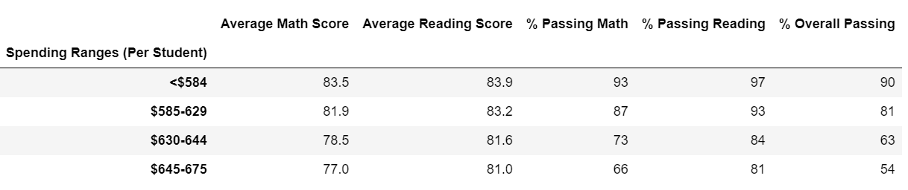
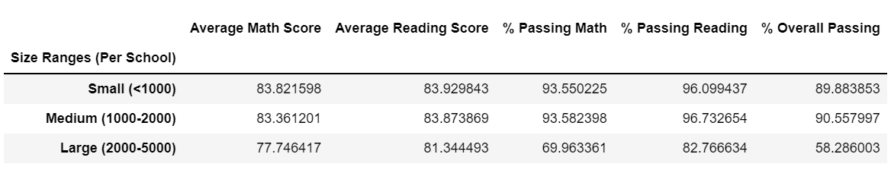
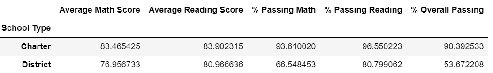

# Module 4 | Assignment - PyCitySchools

Use Python and the Pandas library to analyze school district data and showcase trends in school performance.

## Overview of the School District Analysis
### **Purpose**
  In this project, we are aiming to remove Thomas High School 9th graders' scores from the entire dataset, and process the analysis with the rest of the data regarding the academic performance from different schools, in order to maintain the honesty and accuracy of the academic performance.

## Results: 
### **How is the district summary affected?**
 After removing the Thomas High School - 9th graders' scores, we can see all the average math/reading scores are lower than before. The math/reading and overall passing rates are also lower than before.

### **How is the school summary affected?**
 After removing the Thomas High School -9th graders' scores, and calculate the new average math/reading scores, as well as the passing rates correctly, all the results are slightly lowered than before.

### **How does replacing the ninth graders’ math and reading scores affect Thomas High School’s performance relative to the other schools?**
 By comparing before/after of Thomas High School Summary, with before/after of entire school district summary, we can see the removal of Thomas High School - 9th graders' scores have more impact on the Thomas High School Summary's average math/reading score, than that to the entire school district summary. 

### **How does replacing the ninth-grade scores affect the following:**
  - **Math and reading scores by grade**
     As it's only 1 grade in 1 school, it won't affect the math/reading scores in 10th-12th grade in Thomas High School; Nor does it affect the other schools' math/reading scores by grade.

  - **Scores by school spending**
      Please refer to the  for the result.
      For those schools which are not competitive on math/reading scores, tend to spend more money per student.

  - **Scores by school size**
      Please refer to the  for the result.
      The more students the schools have, the less competitive the students tend to be in the math/reading subjects, the passing rate is lower;

  - **Scores by school type**
      Please refer to the  for the result.
      Students in Charter schools tend to have better performance than those in District Schools.

## Summary: 
  After removing the Thomas High School - 9th graders' scores, we can see following changes to the school district analysis:
       - Overall school district - average math/reading scores become lower than before, which means the dishonesty of the data from Thomas High School - 9th graders' score did damage the data integrity;
       - We can also see the average math/reading scores of the Charter school become lower;
       - The average math/reading scores in the medium size (1000 to 2000 students) schools get lower;
       - The average math/reading scores in the "$630 - $644" spending group schools are also getting lower.
